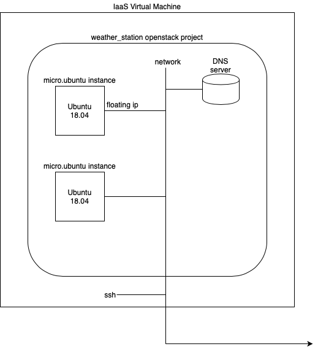
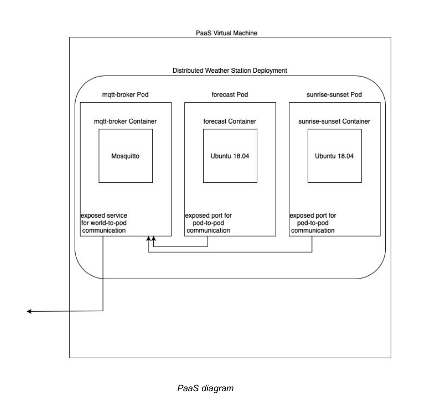

# fog-n-cloud-project-unitn-2020
Repository to hold the necessary material for the Fog and Cloud Computing course at UniTn AY 2019-2020

Architecture: DISTRIBUTED WEATHER STATION
Course: Fog and Cloud Computing 2020/2021
Students:
- R. Micheletto 
- M. Strada 

Our application idea is to integrate both what we studied in the IaaS and PaaS labs together by building a distributed weather station. It will work as follows: the publisher side application is composed of two dummy sensors, a weather forecast for a location (we’ll choose Trento) and a javascript script which gets the time of sunrise and sunset at a location, and a mqtt broker (mosquitto). These three components will be built as 3 Kubernetes pods, with one container each, of a deployment. This is to provide fault tolerance, as if a deployment component goes down, it will be brought back up automatically. The broker mqtt receives the “messages” by the two dummy sensors and, using kubernetes services to communicate outside the cluster, sends them to the subscriber machine. The subscriber machine is a small ubuntu machine running in the IaaS infrastructure, which will have the proper mqtt subscriber running in it. It will subscribe to the mqtt topic, receives it and echoes it in the terminal window. With this kind of application we should be able to have a sample application integrating both technologies.
For the subscriber (IaaS) part, we’ll use a cloud-init script to automate the download of the appropriate dependencies and the subscription to the broker. For the publisher (Kubernetes)
part we will use a .yaml file to automate the process of deployment.

A complete breakdown of the required components along with some explanatory diagrams
are as follows:
- IaaS (ip: stud-3.fc20.fogk.site has internal ip 10.235.103):
- - Users: 2, eval and student
- - Projects (in the OpenStack sense): 1, the mqtt subscriber
- - Images: Ubuntu
- - Flavors: m1.tiny
- - Instances: 1
- - Ssh Keys: 3 pairs, eval and one per student
- - Networks, Floating IPs: a DNS to reach the internet and download
packets and dependencies and 1 floating IP to be able to ssh from
outside
- - Volumes: None
- PaaS (paas-3.fc20.fogk.site has internal ip 10.235.203):
- - Docker containers: 3 total, two for the dummy sensors and one as mqtt broker
- - Docker container images: Ubuntu:18.04, mosquitto
- - Pods: 3, containing each one container with the specific image
- - ReplicaSets: 1
- - Deployments: 1, the weather station
- - Services: 3, two for the dummy sensors and one as mqtt broker
- - Volumes: None
- - Namespaces: Default
- - Labels & Selectors: 3 labels: forecast, mqtt-broker, sunrise-sunset

A full scheme of the architecture can be seen below:

