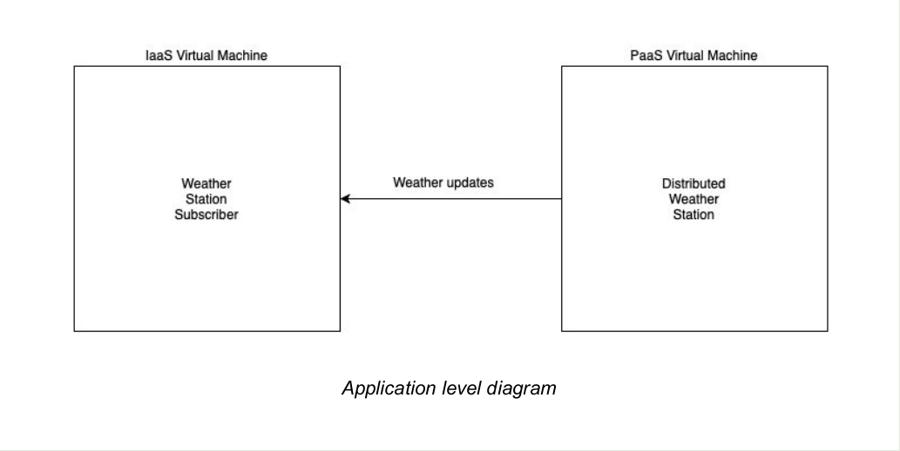
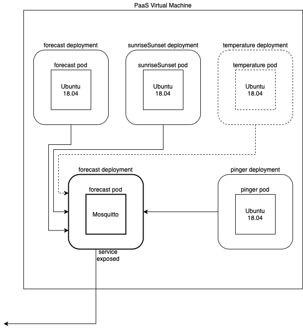

# fog-n-cloud-project-unitn-2020
Repository to hold the necessary material for the Fog and Cloud Computing course at UniTn AY 2019-2020

Architecture: DISTRIBUTED WEATHER STATION
Course: Fog and Cloud Computing 2020/2021
Students:
- R. Micheletto
- M. Strada

Our application idea is to integrate both what we studied in the IaaS and PaaS labs together by building a distributed weather station. It will work as follows: the publisher side application is composed of two dummy sensors, a weather forecast for a location (we’ll choose Trento) and a javascript script which gets the time of sunrise and sunset at a location, and a mqtt broker (mosquitto). These three components will be built as 3 Kubernetes pods, with one container each, of a deployment. This is to provide fault tolerance, as if a deployment component goes down, it will be brought back up automatically. The broker mqtt receives the “messages” by the two dummy sensors and, using kubernetes services to communicate outside the cluster, sends them to the subscriber machine. The subscriber machine is a small ubuntu machine running in the IaaS infrastructure, which will have the proper mqtt subscriber running in it. It will subscribe to the mqtt topic, receives it and echoes it in the terminal window. With this kind of application we should be able to have a sample application integrating both technologies.
For the subscriber (IaaS) part, we’ll use a cloud-init script to automate the download of the appropriate dependencies and the subscription to the broker. For the publisher (Kubernetes)
part we will use a .yaml file to automate the process of deployment.

A complete breakdown of the required components along with some explanatory diagrams
are as follows:
- IaaS (ip: stud-3.fc20.fogk.site has internal ip 10.235.103):
- - Users: 2, eval and student
- - Projects (in the OpenStack sense): 1, the mqtt subscriber
- - Images: Ubuntu
- - Flavors: m1.tiny
- - Instances: 1
- - Ssh Keys: 3 pairs, eval and one per student
- - Networks, Floating IPs: a DNS to reach the internet and download
packets and dependencies and 1 floating IP to be able to ssh from
outside
- - Volumes: None
- PaaS (paas-3.fc20.fogk.site has internal ip 10.235.203):
- - Docker containers: 3 total, two for the dummy sensors and one as mqtt broker
- - Docker container images: Ubuntu:18.04, mosquitto
- - Pods: 3, containing each one container with the specific image
- - ReplicaSets: 1
- - Deployments: 1, the weather station
- - Services: 3, two for the dummy sensors and one as mqtt broker
- - Volumes: None
- - Namespaces: Default
- - Labels & Selectors: 3 labels: forecast, mqtt-broker, sunrise-sunset

A full scheme of the architecture can be seen below:







## Iaas and PaaS Labs connectivity crosscheck
To reach a OpenStack instance inside the IaaS machine from the PaaS machine:
- set a floating IP for the OpenStack instance
- `sudo ip route add 172.24.4.0/24 via 10.235.1.103` in the PaaS machine: add a route to reach the OpenStack instance's floating IP via the IaaS machine

To reach a Docker container in the PaaS machine frome the IaaS machine:
- expose the service of the container from the .yaml file (see exercise e17)
- `sudo ip route add 172.17.0.0/24 via 10.235.1.203`in the IaaS machine: add a route to reach the container's master IP via the PaaS machine
- `sudo iptables -I DOCKER-USER -i ens3 -o docker0 -j ACCEPT` in the PaaS machine: allow packets from interface ens3 (from outside) to reach the interface docker0, where there is the container

## PaaS machine setup
To setup the PaaS machine a running cluster of Kubernetes is needed. For the project on the PaaS machine we used kind, while locally I used minikube, but should be working on whatever method you see fit. The deployment.yaml file also includes a deployment for the weather subscriber, to be able to check if the mqtt broker and the sonsors are working by inside the kubernetes cluster. To deploy everything just run
```bash
kubectl create -f deployment.yaml
```
Other than the needed deployments, a service and a persistent volume for the mosquitto broker will be created.

It is then possible to retrieve the IP address where to reach the service with these commands:

```bash
MASTER_IP=`docker inspect -f '{{range .NetworkSettings.Networks}}{{.IPAddress}}{{end}}' kind-control-plane`
echo $MASTER_IP
```

## IaaS machine setup
The first thing to do is to set the correct IP address of the service, retrieved from the last step of the PaaS machine setup. It is necessary to set it properly in the last line of the ```cloud-init-mosquitto_subscriber.sh``` file. For exemple, if ```$MASTER_IP```is 172.17.0.2, the last line of the cloud init will look like this:
```bash
mosquitto_sub -h 172.17.0.2 -p 30000 -t weatherStation
```

Setup for the IaaS machine will be done in three steps. The first step is to run
```bash
bash openstack_project_preliminary_creation.sh
```
This script will create the required settings for the whole IaaS part, and needs to be run only the first time when setting up the whole project.
The by running:
```bash
bash instance_creation.sh
```
The actual openstack reachable server, based on ubuntu and running the mqtt subscriber, will be created. It will rely on the settings created before by the aforementioned script, and so needs to be run after it. It also contains a call to the cloud-init-mosquitto_subscriber.sh which will take care of handling and downloading all the needed dependencies and start listening for incoming mqtt messages from the appropriate PaaS address.
